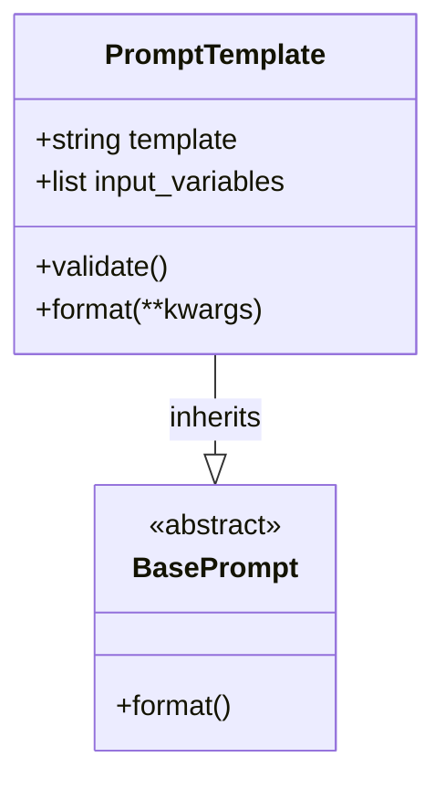

The PromptTemplate class is very synonymous to string template like we see in vue or js.

normally in js `Hello, ${name}!` and name is another variable whose value will be replaced at the time of assigning/compiling the above string 
in vue we see the text interpolation where in the template(tags) we can access the variables by {{varRef}}

On similar grounds, in python prompt template is there, where we need to mention the variables and the normal string 

```
#the object of promptTemplate 
1st way : 
    referencePrompt = PromptTemplate( template="Some string about {mainChar}", input_variables=['mainChar'])
    
2nd way :
    villianPrompt = PromptTemplate.from_template("This story is about villian - {antagonist}")


Access way :
    print(referencePrompt.format(mainChar="IronMan"))
    print(villianPrompt.format(antagonist="Doctor Doom"))

```

