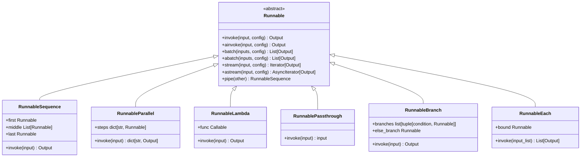

From the simple point of view, runnable is any object that take in some input inside invoke function and then generate some output. So you are just running something and getting some result.

Runnable is an Abstract class meaning some parts are declared and some are implemented by the langchain framework. This abstract class is inherited by all the major other classes and thus most of the things in langchain are runnable implementations or inheriting from it.

Runnable has invoke, ainvoke, stream, batch and such function implmentation or declaration.

It can also be called as an execution contract for langchain. Why execution contract is because langchain restricts or defines that when ever you want to call some things, meaning you run some functionality, you need to call the invoke or ainvoke(async). And this execution contract is respected by most of the objects in the langchain. Thus most of things in the framework are runnable.

These things/runnables can be composed of or chained together. This is also where runnable can be called as chain.
To link 2 chain together we use | (pipe) operator which means output from left to be fed to right's invoke.
newChain = someRun1 | run2 | run3

Now this newChain is also a runnable as it in itself is a runnable composition.
This creates a sequential chain of commands or operations.
For branching operations meaning have some if/then/else kind of conditions RunnableBranch is one such implemented class which can help in this.





RunnableLambda : This is a python class which takes in a function(callable) as an input and convert it into by extending it into a Runnable implementation with invoke,ainvoke, batch and stream functionality.
``` def convertToUPCASE(text){
    return text.upper();
}
#how to call 
print(convertToUPCASE('hello'));
#prints -> HELLO

runnableUpperCase = RunnableLambda(convertToUPCASE);
print(runnableUpperCase.invoke('hello'))
#prints -> HELLO
```

RunnableSequence : This is a LangChain class that combines multiple Runnables into a sequential pipeline. One by One

Each Runnable's output becomes the next Runnable's input.
Think of it as: A → B → C.
``` 
RunnableSequence(prompt, model, parser).
sequence.invoke(input) #runs prompt → model → parser.
```

RunnableParallel : This class runs multiple Runnables concurrently on the same input and collects their outputs.

Think of it as one input → multiple paths → combined output.
``` RunnableParallel(summary=summary_chain, translation=translation_chain).
#If input is "Hello world", both chains receive "Hello world".
#The result is roughly: {"summary": ..., "translation": ...}.```
Unlike RunnableSequence, the steps don't depend on each other's output.
RunnableSequence = A → B → C.
RunnableParallel = A, B, C run independently at the same time.
It supports standard Runnable operations such as invoke(), batch(), and stream().
Can be very  useful when you need multiple independent/seperate results from the same input.

RunnablePassthrough : This class simply passes its input through unchanged to all the arguments/runnables.

Input: "hello" → output: "hello".
It is useful when you want to preserve the original input while building a chain.
Example: RunnableParallel(original=RunnablePassthrough(), processed=my_chain).
Input "hello" could produce: {"original": "hello", "processed": "HELLO"}.
It doesn't transform the input like RunnableLambda does.
It doesn't create a sequence like RunnableSequence.
It doesn't execute multiple branches like RunnableParallel.
Think of it as a "wire" that carries the input forward unchanged.
RunnableLambda → transform input.
RunnablePassthrough → preserve/pass input.
```
from langchain_core.runnables import RunnableBranch, RunnableLambda

# Two different chains
positive_chain = RunnableLambda(lambda x: f"{x} is positive")
negative_chain = RunnableLambda(lambda x: f"{x} is zero or negative")

# Condition
branch = RunnableBranch(
    (lambda x: x > 0, positive_chain),
    negative_chain  # default branch
)

print(branch.invoke(10))
# 10 is positive

print(branch.invoke(-5))
# -5 is zero or negative
Think of it as
             input
               |
          x > 0 ?
          /     \
       True     False
        |         |
   positive    negative
     chain       chain
So the key idea is:

RunnableBranch(condition, runnable_if_true, default_runnable) → choose one path based on the input.
```


RunnablePassThrough : This is simply do nothing just pass it forward
You can use it with RunnableParallel to keep the original input while also processing it:

from langchain_core.runnables import RunnableParallel, RunnableLambda
from langchain_core.runnables import RunnablePassthrough

chain = RunnableParallel(
    original=RunnablePassthrough(),
    uppercase=RunnableLambda(lambda x: x.upper())
)

print(chain.invoke("hello"))
Output:

{
    "original": "hello",
    "uppercase": "HELLO"
}
So remember:

RunnablePassthrough = "Don't modify this input; just pass it along."


RunnableEach :
This class applies the same Runnable to every item in a list/collection.
Think of it as a loop over inputs.
Example: input = [1, 2, 3].
Runnable = lambda x: x * 2.
RunnableEach applies it to 1, 2, and 3.
Output becomes [2, 4, 6].
So conceptually: list → apply Runnable to each item → list.
It is useful when you have multiple independent inputs to process.
It differs from RunnableParallel, which runs different Runnables on the same input.
RunnableEach = same Runnable + many inputs.