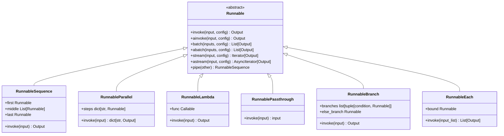

Runnable is an Abstract class meaning some parts are declared and some are implemented by the langchain framework. This abstract class is inherited by all the major other classes and thus most of the things in langchain are runnable implementations or inheriting from it.

Runnable has invoke, ainvoke, stream, batch and such function implmentation or declaration.

It can also be called as an execution contract for langchain. Why execution contract is because langchain restricts or defines that when ever you want to call some things, meaning you run some functionality, you need to call the invoke or ainvoke(async). And this execution contract is respected by most of the objects in the langchain. Thus most of things in the framework are runnable.

From the simple point of view, runnable is any object that take in some input inside invoke function and then generate some output. So you are just running something and getting some result.

These things/runnables can be composed of or chained together. This is also where runnable can be called as chain.
To link 2 chain together we use | (pipe) operator which means output from left to be fed to right's invoke.
newChain = someRun1 | run2 | run3

Now this newChain is also a runnable as it in itself is a runnable composition.
This creates a sequential chain of commands or operations.
For branching operations meaning have some if/then/else kind of conditions RunnableBranch is one such implemented class which can help in this.

